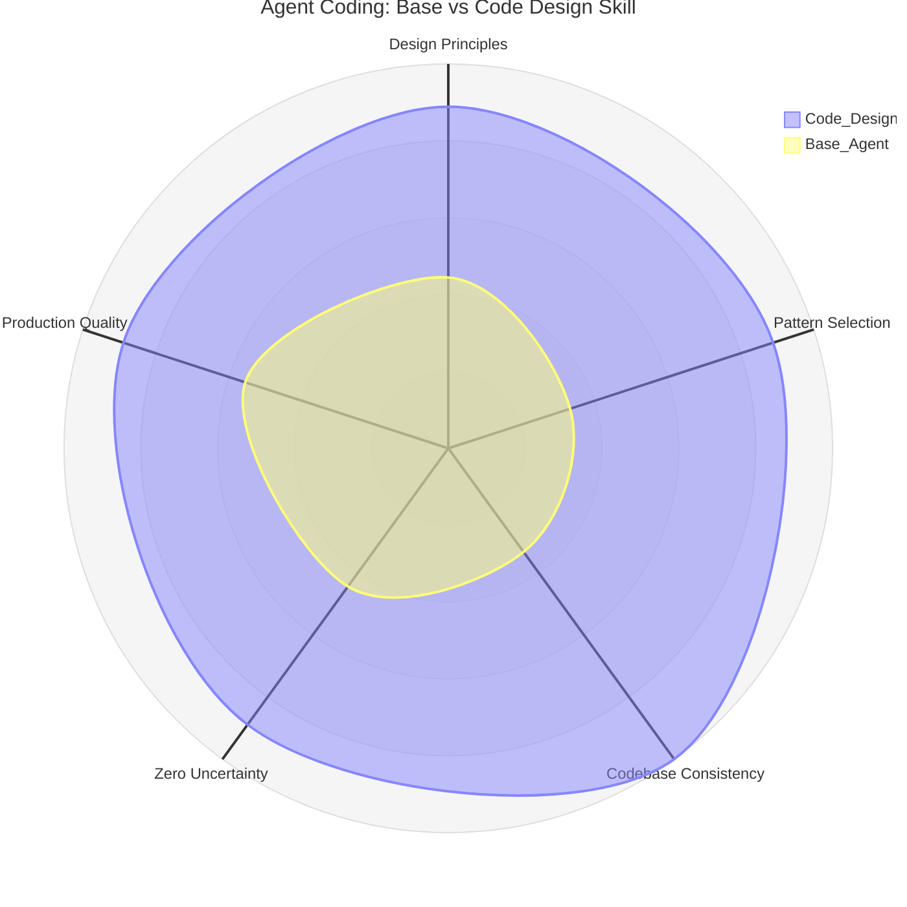

# Code Design Skill

Production-grade coding behavior for AI agents — any language, any framework. Complements [mindful-precision](../mindful-precision) by focusing specifically on code quality and design decisions.

## What This Skill Does

This skill makes the agent:
- **Resolve uncertainty before coding** — ask first, code second
- **Respect existing codebase patterns** — naming, structure, conventions
- **Apply design principles with clear priority** — SoC > DRY > YAGNI > KISS > Fail Fast > SOLID > LoD
- **Write clean code** — explicit naming, guard clauses, ≤30 line methods, ≤3 nesting levels
- **Choose design patterns by need** — decision tree from problem to pattern
- **Handle tech debt explicitly** — notify, TODO, ask before refactoring
- **Use formatters** — always apply the project's formatter before presenting code
- **Commit atomically** — conventional commits, one change per commit

## Philosophy

> **Write code as if it ships to production today. Every function, class, and module should be clean, intentional, and maintainable.**



## Core Behaviors

### Zero Uncertainty Before Coding
Don't start until you know: what's needed, what exists, what's the scope, what could fail.

### Respect Existing Patterns
Scan the codebase first. Follow established conventions. When you find violations, notify the user and leave a TODO — don't silently follow anti-patterns or silently break convention.

### Prioritized Design Principles
SoC → DRY → YAGNI → KISS → Fail Fast → SOLID → Law of Demeter. When principles conflict, higher priority wins.

### Clean Code Heuristics
- Explicit naming, no acronyms — follow language style guides
- Guard clauses over nested conditionals
- Methods ≤ 30 lines, nesting ≤ 3 levels
- Always use the project's formatter

### Pattern Decision Tree
Three decision trees (creational, structural, behavioral) guide from problem to the right pattern — and explicitly say when NOT to use one.

### Testing & Commits
- Tests after functionality is stable — unit tests first
- Atomic conventional commits — one logical change per commit

## Composition with mindful-precision

This skill handles **code quality and design**. [mindful-precision](../mindful-precision) handles **agent behavior** (verify before reporting, critical thinking, security, resourcefulness, token efficiency). They're designed to work together.

## Documentation

- **[references/design-patterns.md](references/design-patterns.md)** — Full catalog of 23 GoF patterns with use cases and selection guide

## Installation

```bash
npx skills add https://github.com/jheisonmb/skills --skill code-design
```

## License

MIT License
